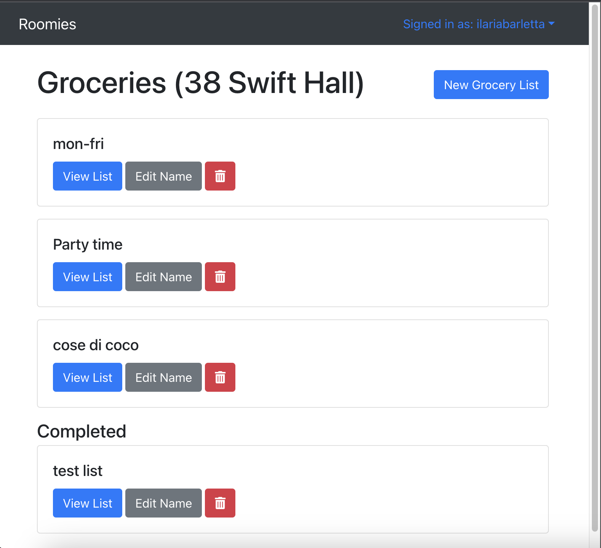

# Roomies

Roomies is a website addressed to people sharing an household. If you have roommates and you need to take care of sharing rent and groceries, Roomies is for you. It is possible to create households, add members, keep track of the due rent and create grocery lists as well as assign items to specific housemates. They say sharing is hard, Roomies makes it easier.

The live link to the project is here: https://roomiesui-16b4bb6864ed.herokuapp.com/
___

# Features 

## Welcome Page :

This is the welcome page page that the user sees before registering or logging in. 
The content is centered and the style is clean and simple.The image makes the scope of roomies clear 
and the additional concise text explains quickly what roomies is for. 
There is a navigation bar that at this stage contains only the name of the website and a link to the sign in form. 
The navigation bar will change slighly and show the name of the signed in user once they are logged in.
There are then 2 buttons that let the user sign up if they are new or sign in if they are known users. 

## Home Page (Household Details)
 The homepage is represented by the main household a user has registered on the platform. The name of the household is displayed on the top of the page so that the user can esily identify it (this is useful if for example the user has more than 1 household i.e. they manage more than one property).The page shows multiple sections: "members", "rent", "groceries". Initially only the member area is expanded to give a clear overview of who the members are and who the creator of the household is but the other sections can be expanded too by clicking on them and will provide more details regarding rent and groceries. The household actions button and the members actions button both present in the homepage will let the user create a new household or edit/ delete the one they are looking at as well as add members to the household.  

## All Households 

This page contains a list of all the household for the signed in user. The user has the option here to create a new household and by clicking on the `new household` button they will be taken to the relevant form, as well as see the list of all the households they have registered on the platform. In the list it is possible to identify the household by its name and each household has 3 buttons that will take the user to view details, edit  and delete the household 

## Household Members
The household members are visible from the homepage but by clicking on the `members actions` button, the creator will be offered the opportunity to add members. When adding members the user will be able to search for the username by inputting the name of part of it in the searching bar. When hitting `search` they will be shown a list of all the registered user with the selected username and they will be able to add them to the household via the `add` button.In order to delete members, the user can simply click on the delete button from the homepage and after confirming their action they will see the refreshed list no longer showing the member just deleted.  

## Household Rent 

The rent section shows the total rent amount and the amount due by the logged in user. It also shows the status of the payment for the other members. If rent is due, a `due` sign will show beside the name of the user that has yet to pay it. The rent actions button let the user `pay rent`(so that they confirm they have paid their share), and if the user logged in is the creator of the household they will also have the option to `mark rent as due` (in order to restart the payments when the next cycle stars) and `mark rent as complete` (when everyone has paid for that cycle).

## Grocery Lists 
The grocery lists page shows a list of all the grocery lists for the household. The way this page has been built is consistent with the way the all household page was built so the user will have no issues in navigating it.  The `new grocery list` button will take the user to the relevant form in order to create a new list. Once the list is created then new items can be added to it. From this page the user has the option to view the list, edit the nane of the same or delete it. Lists can be either completed or incomplete. The completed list will all show at the bottom of the page. 

### Grocery List Details 

Each grocery list has a name and shows the creation date and the name of the user that created it. The font picked for the list itself reminds of handwriting so will make it easier for the user to identify the items in the list from the rest of the text. From the `list actions` button the user is able to edit, delete and mark the list as complete (only the creator of the list is allowed to do so), as well as add new items and add comments. 

#### Items 

Items can be added using the `list actions` button but they can then be managed using the `item actions` button present beside each item. The available actions are mark as complete, edit and delete. The edit option will let the user change or pick an assignee (the person that, in the household, is in charge for that item). There is as well an option to filter items by assignee and or status. By clicking on the filter icon, the user will be taken to the filters selection. In this way they will be able to filter all the items they are to get or all the items another member of the household is in charge of. 

#### Comments  
Comments can be left by the user in every grocery list to communicate with the other members. Comments can be seen by all members but managed only by the user that left them in the first place. The `manage` button will be visible only beside comments left by the logged in user. The manage button will let the user either edit their own comment or delete it. 

# UX Design

 In Roomies my main goal was to build a useful and intuitive app that helps people to manage their household in a simple way. By using a series of buttons the user is allowed to perform actions like create households, add members to it, update rent payments, create grocery lists, add grocery items, assign the items to specific members and leave comments to the lists.The app is easy to navigate and to give a better experience to the user, it provides confirmation every time an action is performed letting the user  know if it's successfull or if an error occured.The user  will also receive details on how to fix such errors in order to proceed. The design picked here is minimal, the main image is a drawing of a household that I generated here : https://hotpot.ai/art-generator and that reflects the purpose of the app (a house shared by multiple people) making, in my opinion,  the scope of the app clear even before reading. 
## Navigation 

### Navigation Bar 
The navigation bar is minimal and for a non logged in user contains the name of the app and the sign in link that will take them to the form they need to fill in order to get access. Once the user is logged in the signed in link will also show the name of the user and will, if clicked, provide the option to sign out. To make it convenient for logged in users to get back to their main household when they are visiting different pages, for example if they are checking the grocery lists page, the `Roomies` site name link in the navigation bar will take them back to the page of their main household.

### Navigating to and from forms 
I have built this app so that all the main pages have a consistent structure regarding the style and the functionalities. This means that users will find it easy to use the various different parts of the app as they all look and behave in a consistent way. Household, grocery lists, grocery items and comments pages are all made of forms that the user needs to fill in order to create and update them. Users are able to navigate to the relevant form from the model page to either create or edit and then users are able to either submit the form or go back to where they came from via a consistent `back` button that is present on every from. This means that once users have used a single form in the app, they will be used to the structure for all of the others. 

### Model Actions 

In order to perform different CRUD operations on the different models available throughout the app, I have opted for a Dropdown Button approach which is present in all the places where I show model details (household, groceries, members, rent, etc). The dropdowns all follow a similar pattern and allow users to perform important actions on the relevant model. I have decided on this approach as it allows me to group actions together on the page and means that users will always know where to look to perform actions across the different sections in the app. 

### User Feedback
I have added a few features to ensure that users are always aware of what is happening in the application. 

#### Toast Notifications 

The first of these features is the use of toast notifications for all user actions. Whenever a user performs an action that uses the API a toast notification is always shown after the API responds which lets the user know that the action has finished. The toast messages shown are styled depending on if the action was successful or not and disappear after a few seconds. 

#### Form Errors 

I have also provided detailed error information on forms so users know why their action failed (and not just that it did which the Toast notification will inform them of). All forms in the app have error messages for their fields which will show information underneath the field detailing if something was wrong with the user input. An example would be omitting a required field - this information would then be displayed in an alert under the field so the user knows they need to fill it in. 

## Wireframes 
Wireframes for the project were created using Figma and can be viewed on Figma 

## Agile 

### Stories
In this project I have used the agile method, a link to the Github project and stories can be found [here](https://github.com/users/ilaria-barletta/projects/3).

### Epics
I have also created several Github Milestones to track the Epics for the application and they can be viewed [here](https://github.com/ilaria-barletta/roomies-api/milestones?with_issues=no). A screenshot of the epics is also shown below. 

# Technologies Used
* HTML5 
* CSS 
* Bootstrap 5 
* React   
* FontAwesome 
* Figma

___
# Testing 

## User stories testing / manual testing 

I have tested the app thoroughly and you can see the outcome of the manual testing below where I've detailed each feature tested in separate tables. You can also see the user story in Github which contains the acceptance criteria which aided the testing. 

1. Homepage: [Github Story](https://github.com/ilaria-barletta/roomies-api/issues/22):

| Test        | Outcome     |
| ----------- | ----------- |
| The homepage clearly describes what Roomies is for so users clearly understand if they're in the right place       | Pass        |
| Sign in button is present and takes user to sign in  form        | Pass        |
| Sign up button is present and takes user to sign up form      | Pass        |

2. Site log in : [Github Story](https://github.com/ilaria-barletta/roomies-api/issues/20):

| Test        | Outcome     |
| ----------- | ----------- |
|     The Login button in the homepage takes the user to the log in form.   | Pass        |
|     In the form the user is asked to provide: Username & Password   | Pass        |
|      If the user clicks on the sign in button after providing correct login details, they're logged in and taken to their household  | Pass        |
|     If the user clicks on "Don't have an account? Sign up" they're taken to the sign up form   | Pass        |

3. Site registration : [Github Story](https://github.com/ilaria-barletta/roomies-api/issues/21):

| Test        | Outcome     |
| ----------- | ----------- |
|    The sign up button in the home page takes the user to the registration form where they're asked to provide:
Username, Password, Confirm password    | Pass        |
|     If the user clicks on sign up and they fill the form, they are taken to the sign in page   | Pass        |
|     If the user clicks on "Already have an account? Sign in", they are taken to the sign in form.   | Pass        |

4. Create Household : [Github Story](https://github.com/ilaria-barletta/roomies-api/issues/3):

| Test        | Outcome     |
| ----------- | ----------- |
|    The user can click on the "new household" button and they're taken to the create a new household form.    | Pass        |
|    The user is asked to provide a name (mandatory field)    | Pass        |
|    The user is asked to provide a rent (optional field)    | Pass        |
|    If the user clicks on the create button after filling the form, they are taken to the "All households" page where the new household will be listed   | Pass        |
|    If the user clicks on back to homepage, they are taken either back to the page of their first household (if they have one), or back to the page showing that there are no households yet if they don't.    | Pass        |

5. Update Household : [Github Story](https://github.com/ilaria-barletta/roomies-api/issues/4):

| Test        | Outcome     |
| ----------- | ----------- |
|     The user can click on the "edit household" button and they're taken to the edit household form.   | Pass        |
|   The form is pre-filled with the info previously provided    | Pass        |
|    The user can edit both name and rent    | Pass        |
|    If the user clicks on the edit button they are taken to the "All households" page where the household will be listed and will show the new details when clicked on    | Pass        |
|   If the user clicks on back to homepage, they are taken back to the page of their first household.     | Pass        |

6. Delete household : [Github Story](https://github.com/ilaria-barletta/roomies-api/issues/29):

| Test        | Outcome     |
| ----------- | ----------- |
|     The user can click on the "delete" button and they're asked to confirm if they want to proceed   | Pass        |
|     Once the user confirms they are taken back to the all households list where the deleted household will no longer show   | Pass        |

7. View household details : [Github Story](https://github.com/ilaria-barletta/roomies-api/issues/5):

| Test        | Outcome     |
| ----------- | ----------- |
|   The user can see the name of the household     | Pass        |
|    The user can see if rent is due from their side because a banner shows when they haven't paid rent yet    | Pass        |
|    The user can see and manage the members    | Pass        |
|    The user can see and manage the rent    | Pass        |
|    The user can see and manage the groceries    | Pass        |
|   The user can click on "View all your households" and will be taken to the relevant page where all the households he has are listed     | Pass        |

8. All households list : [Github Story](https://github.com/ilaria-barletta/roomies-api/issues/6):

| Test        | Outcome     |
| ----------- | ----------- |
|    The user that clicks on "View all your households" is taken to a list of all their households.    | Pass        |
|     Each household in the list shows the name of the household and 3 buttons to view, edit and delete the household.   | Pass        |
|    When clicking on the "view" button, the user is taken to the household details page    | Pass        |
|    When clicking on the "edit" button, the user is taken to the edit household page    | Pass        |
|    When clicking on the delete button, the user is shown a message asking to confirm if they want to delete the household. If they do, they will be shown the all households list updated without the household they have just cancelled.    | Pass        |

9. Create grocery list : [Github Story](https://github.com/ilaria-barletta/roomies-api/issues/17):

| Test        | Outcome     |
| ----------- | ----------- |
|     From the "household actions" button the user can select "new grocery list" in order to create a new list.   | Pass        |
|    The new grocery list button takes the user to the "create a new grocery list" page where they can type the name of the list and then hit create in order to create it.    | Pass        |
|    Once the list is created via the list actions button the user can start adding items to it and each item can also individually be assigned to one of the members of the household.    | Pass        |

10. Update grocery list : [Github Story](https://github.com/ilaria-barletta/roomies-api/issues/12):

| Test        | Outcome     |
| ----------- | ----------- |
|   From the groceries lists list page the user can see a edit name button for every list.     | Pass        |
|     Once clicked, the edit name button takes the user to the "edit grocery list" form. Here the name is already pre-filled with the name previously picked for the list and can be edited.   | Pass        |
|    The update button, if clicked, will take the user to the grocery list page now updated    | Pass        |
|    The back button, if clicked, will take the user back to the groceries lists list    | Pass        |

11. Delete grocery list : [Github Story](https://github.com/ilaria-barletta/roomies-api/issues/15):

| Test        | Outcome     |
| ----------- | ----------- |
|   From the groceries lists list page the user can see a delete button for every list.     | Pass        |
|    Once clicked, the delete button brings up a message asking the user to confirm the deletion action. If confirmed, the grocery lists page gets updated and the deleted list will no longer show.    | Pass        |

12. Create grocery list comments : [Github Story](https://github.com/ilaria-barletta/roomies-api/issues/2):

| Test        | Outcome     |
| ----------- | ----------- |
|     The list actions button presents the option to create a comment: "New comment"   | Pass        |
|     If the user clicks on "new comment", they are taken to the create a new comment form.    | Pass        |
|    The form presents a content field where the user can type the content. The comment field cannot be left blank.    | Pass        |
|   The create button at the bottom of the form creates the comment and takes the user back to the grocery list page where the comment will show in the comments section     | Pass        |
|     The back button will take the user back to the grocery list page without any change.   | Pass        |

13. Update grocery list comments : [Github Story](https://github.com/ilaria-barletta/roomies-api/issues/7):

| Test        | Outcome     |
| ----------- | ----------- |
|     The manage button that shows beside the comment left by the logged in user contains the edit option   | Pass        |
|   If the user clicks on "edit", they're taken to the "update comment form" where the content will be already filled with the previous comment.     | Pass        |
|    Once the user has updated the content they can click on the update button that will take them back to the grocery list page where the new comment will show under the comments section    | Pass        |
|    If they click on `back`, they will go back to the grocery list page where there will be no changes.    | Pass        |

14. Delete grocery list comments : [Github Story](https://github.com/ilaria-barletta/roomies-api/issues/1):

| Test        | Outcome     |
| ----------- | ----------- |
|    The manage button showing beside the comment left by the logged in user contains the delete option    | Pass        |
|    If the user clicks on "delete", a message will pop up to confirm if they want to delete that comment.    | Pass        |
|     Once the user has confirmed that they want to delete the comment the page refreshes and the deleted comment will no longer show.   | Pass        |

15. Groceries lists list : [Github Story](https://github.com/ilaria-barletta/roomies-api/issues/18):

| Test        | Outcome     |
| ----------- | ----------- |
|    By clicking on " view all the grocery lists for this household" link present in the groceries section the user is taken to the groceries lists list.    | Pass        |
|    The page shows all the groceries lists differentiating between completed and unfinished lists. | Pass        |
|     The page presents a button to create a new grocery list.   | Pass        |
|    Each list presents three buttons to view the list, edit the name and delete the list.    | Pass        |
|    If there are completed lists for the logged in user's household, they are show after all the not completed grocery lists    | Pass        |

16. View grocery list details : [Github Story](https://github.com/ilaria-barletta/roomies-api/issues/16):

| Test        | Outcome     |
| ----------- | ----------- |
|    From the view list button in the groceries lists list page, the user can access every list for their household.    | Pass        |
|    The list shows the name, the creator and the date of creation | Pass        |
|    The items in the list can be managed    | Pass        |
|    The comments in the list can be managed.    | Pass        |

17. Create grocery list item : [Github Story](https://github.com/ilaria-barletta/roomies-api/issues/14):

| Test        | Outcome     |
| ----------- | ----------- |
|  From the list actions button, the user can select new item in order to add an item to the list.      | Pass        |
|     The button will take the user to the "Create a new grocery item" form where they will be asked to provide a name for the item and select an assignee for it.   | Pass        |
|    The list of the assignee includes all the members of the household.    | Pass        |
|    The create button will create the item and the user will be taken to the grocery list showing now the item and the assignee (if one has been selected)    | Pass        |
|    The back button will take the user back to the grocery list that will not show any change.    | Pass        |

18. Update grocery list item : [Github Story](https://github.com/ilaria-barletta/roomies-api/issues/9):

| Test        | Outcome     |
| ----------- | ----------- |
|    From the item action button present for each item in the a grocery list, the user can select "edit".    | Pass        |
|    When the user clicks on edit they are taken to the Edit grocery item form where they can edit the name and/or the assignee.    | Pass        |
|    The update button can be clicked when the change is completed and the user will be taken back to the grocery list now showing the updated data    | Pass        |
|    If the user clicks on back they're taken back to the grocery list and no changes will show.    | Pass        |

19. Delete grocery list item : [Github Story](https://github.com/ilaria-barletta/roomies-api/issues/13):

| Test        | Outcome     |
| ----------- | ----------- |
|     From the item action button present for each item in the a grocery list, the user can select "delete".   | Pass        |
|    When the user clicks on delete they are asked to confirm their action with a confirmation message. If they confirm their choice they are taken back to the grocery list where the deleted item will no longer show.    | Pass        |

20. Allow filtering grocery list items by household members : [Github Story](https://github.com/ilaria-barletta/roomies-api/issues/8):

| Test        | Outcome     |
| ----------- | ----------- |
|    From the grocery list page the user has the option to apply filters by clicking on the filters icon.  | Pass        |
|    The filters applicable are assignee and status.  | Pass        |
|    When filtering by assignee the user can pick one of the name of the members of the household and see what items are assigned to them | Pass        |
|    when filtering by status the user can see which items have been already completed and which items are instead still pending | Pass        |
|     To apply the selected filters the user can click the save changes button  | Pass        |

21. Mark grocery lists as complete/incomplete : [Github Story](https://github.com/ilaria-barletta/roomies-api/issues/11):

| Test        | Outcome     |
| ----------- | ----------- |
|   In the list actions button the user can select "mark as complete" if they wish to change the status of their grocery list to complete.     | Pass        |
|    The user will be asked to confirm their action with a banner message informing them that the items of a list that has been completed can no longer be modified. If they click on update they will be taken to the groceries list list and the completed list will show there under completed    | Pass        |
|    Once a list has been marked as completed, it can be then moved back to incomplete.    | Pass        |

22. Mark grocery items as complete/incomplete : [Github Story](https://github.com/ilaria-barletta/roomies-api/issues/10):

| Test        | Outcome     |
| ----------- | ----------- |
|    In the items actions button the user can select "mark as complete" if they wish to change the status of their grocery item to complete.    | Pass        |
|   The user will be asked to confirm their action with a banner message asking them to confirm if they want to update the status of the item     | Pass        |
|    As soon as they confirm the user will be shown the updated grocery list with the completed item now erased by a line    | Pass        |
|    When marked as completed, an item can be then moved back to incomplete    | Pass        |

23. Add search bar when choosing members : [Github Story](https://github.com/ilaria-barletta/roomies-api/issues/23):

| Test        | Outcome     |
| ----------- | ----------- |
|    The "members actions" button lets the user add a new member.    | Pass        |
|    When clicking on add a new member the user is taken to a new page where a search bar shows.    | Pass        |
|    The user can start typing the name of the member they wish to add and as soon as they click on the search button, they are shown all the possible users they can add.    | Pass        |
|     If the user clicks on the back button they're taken back to the household page.   | Pass        |

24. Loading indicators : [Github Story](https://github.com/ilaria-barletta/roomies-api/issues/28):

| Test        | Outcome     |
| ----------- | ----------- |
|     Every time a page is loading a spinner is shown.   | Pass        |

25. Error handling in forms : [Github Story](https://github.com/ilaria-barletta/roomies-api/issues/24):

| Test        | Outcome     |
| ----------- | ----------- |
|     Sign in: username and password are mandatory fields, the user is informed of the same if they try to access not providing them  | Pass        |
|   Sign in: the "Unable to log in with provided credentials" message shows if credential provided are incorrect.      | Pass        |
|  Sign up: username, password and confirm password are mandatory fields. The user is informed of the same if they try to sign up not providing them      | Pass        |
|  Sign up: if the username selected is already in use by someone else, the user is informed of the same      | Pass        |
|   Sign up: if the password selected is too short, the user is informed of the same.     | Pass        |
|   Create a new household / Edit household: the name field is mandatory, if the user tries to proceed without providing one, they're informed of the same     | Pass        |
|     Create grocery list / Edit grocery list: The name field is mandatory, if the user tries to create a grocery list without a name, they're informed that the field cannot be left blank   | Pass        |
|     Create a new grocery item / Edit grocery item: The name of the item is a mandatory field, the user is informed of the same if they don't provide one and try to proceed.   | Pass        |
|     Create a new comment / Edit comment: The content of the content is mandatory, the user is informed of the same if they try to proceed without typing one.   | Pass        |

26. Actions confirmations : [Github Story](https://github.com/ilaria-barletta/roomies-api/issues/26):

| Test        | Outcome     |
| ----------- | ----------- |
|    Sign in : successfully signed in pop-up message shows when user action is successful    | Pass        |
|    Sign up : successfully signed up pop-up message shows when user action is successful    | Pass        |
|    Sign out :successfully signed out pop-up message shows when user action is successful    | Pass        |
|    Created household :successfully created household pop-up message shows when user action is successful   | Pass        |
|   Updated household :successfully updated household pop-up message shows when user action is successful     | Pass        |
|    Deleted household :successfully deleted household pop-up message shows when user action is successful    | Pass        |
|    Added household member :successfully added household member pop-up message shows when user action is successful    | Pass        |
|   Deleted household member :successfully deleted household member pop-up message shows when user action is successful     | Pass        |
|    Created grocery list :successfully created pop-up message shows when user action is successful    | Pass        |
|    Updated grocery list :successfully updated grocery list pop-up message shows when user action is successful    | Pass        |
|    Deleted grocery list : successfully deleted grocery list pop-up message shows when user action is successful    | Pass        |
|    Updated status of grocery list : successfully updated grocery list status pop-up message shows when user action is successful    | Pass        |
|    Updated status of grocery item : successfully updated grocery item status pop-up message shows when user action is successful    | Pass        |
|    Created grocery list item : successfully created grocery item pop-up message shows when user action is successful    | Pass        |
|   Updated grocery list item : successfully updated grocery item pop-up message shows when user action is successful    | Pass        |
|   Deleted grocery list item : successfully deleted grocery item pop-up message shows when user action is successful    | Pass        |
|    Created comment : comment successfully created pop-up message shows when user action is successful    | Pass        |
|   Updated comment : comment successfully updated pop-up message shows when user action is successful     | Pass        |
|   Deleted comment : comment successfully deleted pop-up message shows when user action is successful   | Pass        |

## Bugs 

### Fixed Bugs 
`1`

**Expected** : When a user filters grocery list items by assignee, the assignee should be shown as selected in the radio options in the form.

**Testing** : I tested this by applying a filter to a grocery list items list, by selecting a particular user to filter by. I then applied the filter, closed the modal, and reopened again to change the filter.

**Result** : When reopening the filter list the previously selected filter was not displayed. 

**Fix** : The cause of this issue was the code to check if a radio option should be selected. It was comparing the filter to a user id. I used strict equals to check (`===`) but it turned out that the types of the two variables were different. In this case one was a string and one was an integer. I fixed this bug by converting both to strings using `toString`

`2`

**Expected** : The user should be redirected to the sign in screen if their login has expired after not using the app for a while. 

**Testing** : I tested this by leaving the application open for a little while and letting my login expire on various different pages in the app. 

**Result** : On resuming use of the app pages wouldn't load correctly and loading icons would remain on the page indefinitely.

**Fix** : The cause of this issue was that I had not correctly set up the Axios code which handled intercepting errors and performing redirects. The fix here was to apply a redirect in the user context code which sent users back to the sign in page. 

`3`

**Expected** : The user should be able to delete a household member clicking on the delete button beside their name.  

**Testing** : I tested this by deleting several household members in a row by clicking the delete button next to their name, randomly choosing which member to delete. 

**Result** : I noticed that the correct household member wasn't always deleted and sometimes the wrong member ID was getting sent to the API. 

**Fix** : The cause of this issue was that I was storing the member to delete to show in a confirmation modal. However, I didn't always reset it properly when cancelling from the modal or when clicking around. The fix here was to make sure I always reset the member to delete to `null` when the modal closed. 

# Deployment, Forking and Cloning 

## Deployment
The project has been deployed using Heroku. Here are the step to follow for the deployement:

1. Access your Heroku account and click on "create a new app", name the app and select the region before hitting the create app button.   
2. Navigate to the settings tab and create config vars for cloudinary, the database, and the secret key
3. Navigate to the deploy section and select Github as deployment method. After confirming that we want to connect to Github we can then search for the Github repository name. Once we find it we can click on connect. 
5. Scroll down and select enable automatic deploys

The live link to my project is here: https://roomiesui-16b4bb6864ed.herokuapp.com/

## Forking & Cloning
To fork this repository click on the "Fork" button in the top right of the repository in Github. 

To clone this repository:
1. Click the "Code" button in the repository. 
2. Copy the clone link.
3. Use git to clone the copied link: `git clone LINK`. 